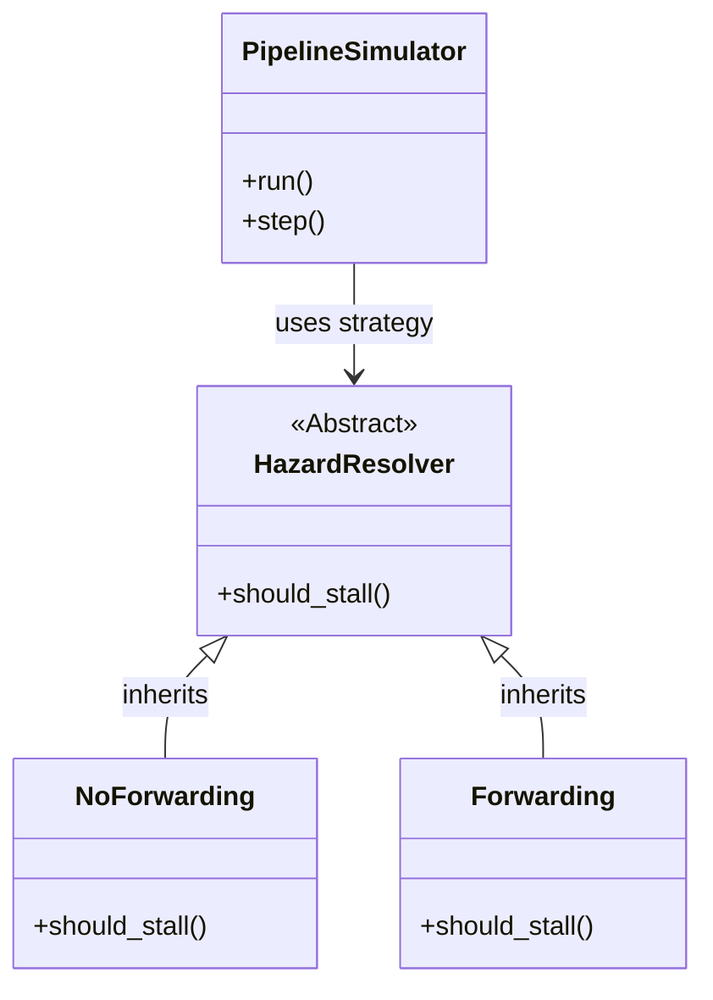

# 🚀 CPU Instruction Pipeline Simulator


> **A cycle-accurate simulator for a 5-stage RISC pipeline. It visualizes Data Hazards and demonstrates the performance boost of Operand Forwarding using the Strategy Design Pattern.**

---

## 📖 Table of Contents
- [Project Overview](#-project-overview)
- [Pipeline Architecture](#-pipeline-architecture)
- [Software Design (Strategy Pattern)](#-software-design-strategy-pattern)
- [Performance Results](#-performance-results)
- [How to Run](#-how-to-run)
- [Team Members](#-team-members)

---

## 📌 Project Overview

In high-performance computing, **Pipelining** is key to speed. This project simulates how a CPU executes instructions by breaking them into 5 stages.

It specifically addresses **Data Hazards (RAW)**—when an instruction needs data that hasn't been written back yet. We implemented two strategies to handle this:
1.  **Stalling (No Forwarding):** The safe, slow way (Waiting).
2.  **Forwarding:** The smart, fast way (Bypassing memory).

---

## 🏗️ Pipeline Architecture

The simulator moves instructions through the following standard RISC stages:


* **IF:** Fetch instruction from memory.
* **ID:** Decode & read registers.
* **EX:** Calculate (ALU operation).
* **MEM:** Read/Write to data memory.
* **WB:** Write result to register file.

---

## 🧩 Software Design (Strategy Pattern)

To make the code modular and clean, we used the **Strategy Design Pattern**. This allows us to switch hazard handling logic dynamically without changing the core simulator code.



---

## 📊 Performance Results

We benchmarked a sample instruction sequence with dependencies (`RAW`) to compare the two strategies.

| Metric | 🐢 No Forwarding | 🐇 With Forwarding | 🟢 Improvement |
| :--- | :--- | :--- | :--- |
| **Total Cycles** | **15** Cycles | **11** Cycles | **Faster** |
| **Stalls Incurred** | 4 Stalls | 0 Stalls | **No Waiting** |
| **Throughput** | Lower | Higher | **~26% Boost** |

> **Analysis:** By using Forwarding, we eliminated the need to wait for the Write-Back stage, allowing dependent instructions to execute immediately using data from the ALU output.

---

## 🚀 How to Run

1.  **Clone the repository:**
    ```bash
    git clone [https://github.com/seif1436/CPU-Pipeline-Simulator.git](https://github.com/seif1436/CPU-Pipeline-Simulator.git)
    cd CPU-Pipeline-Simulator
    ```

2.  **Install dependencies:**
    ```bash
    pip install matplotlib
    ```

3.  **Run the Simulation:**
    * Open `src/Pipeline_Simulator.ipynb` in **Jupyter Notebook** or **VS Code**.
    * Run all cells to see the **Gantt Chart Visualization** and detailed logs.

---

## 👥 Team Members

| Name | Role |
| :--- | :--- |
| **Seif Eldin Mohamed** | Lead Developer & Architecture & Implementation |
| **Mohamed Essam** | Implementation Logic |
| **Mohamed Medhat** | Research & Testing |
| **Saeed Waleed** | Data Analysis |


**Supervised by:** Prof. Dr. Hossam Reda Mohamed

---
<p align="center">
  Made with ❤️ by Zagazig University Students | HPC Course 2025
</p>

